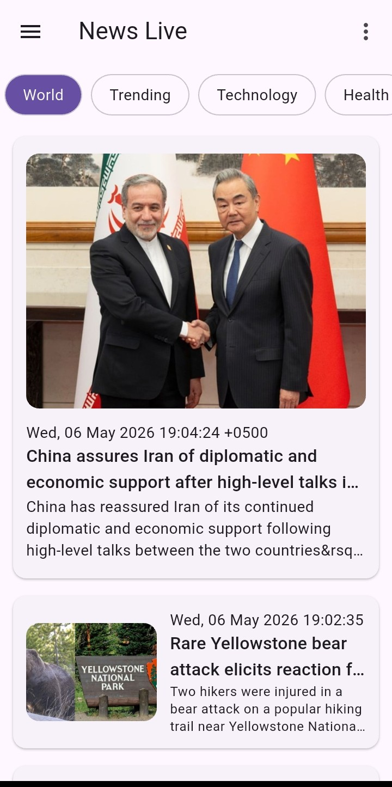
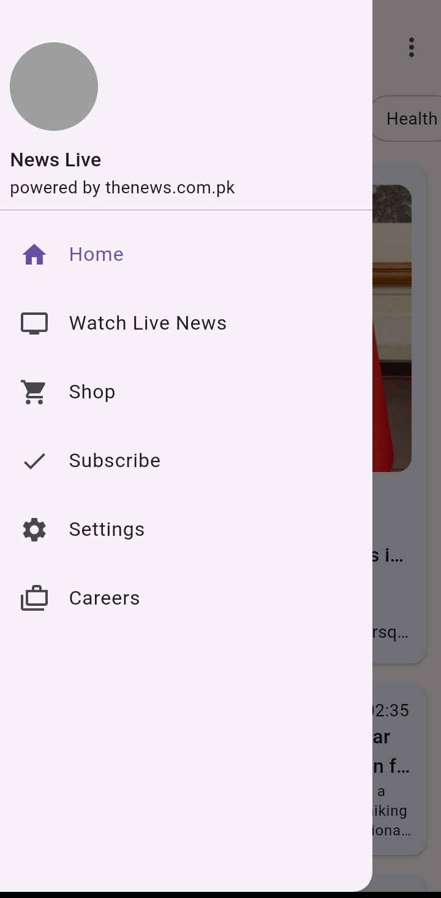

📰 News Live - Flutter Newsletter App

A modern Flutter application that delivers the latest news across multiple categories and allows users to watch live news channels directly within the app.

 Features

* 🗞️ Browse news by categories (World, Trending, Technology, Health, Sports, etc.)
* 🔄 Real-time data fetching using API
* 📺 Watch live news channels (ARY, GEO, DUNYA) via YouTube integration
* 📱 Responsive and scrollable UI
* 🎯 Clean navigation with Drawer menu
* 🔗 Open full news articles in browser
* ⚡ Fast and dynamic content updates

 Screenshots

  
  
  
  

Getting Started

1.Clone the repository

git clone https://github.com/your-username/news-live-app.git

2.Navigate to project folder

cd news-live-app

3.Install dependencies

flutter pub get

4. Run the app

flutter run

 Built With

* Flutter
* Dart
* HTTP package (API integration)
* url_launcher
* youtube_player_flutter
 API Used

This app fetches news data from:

http://androidstudent.com/apis/thenews/news.php

Categories are dynamically loaded using query parameters.

 Live News Feature

Users can watch live streams of popular Pakistani news channels:

* ARY News
* GEO News
* Dunya News

Powered by YouTube live streaming integration.

UI Highlights

* Material Design-based layout
* Card-based news display
* Horizontal category selector (chips)
* Drawer navigation system
* Image-rich content cards

 Known Limitations

* API is third-party (may be slow or unavailable sometimes)
* No offline support
* No search functionality yet
